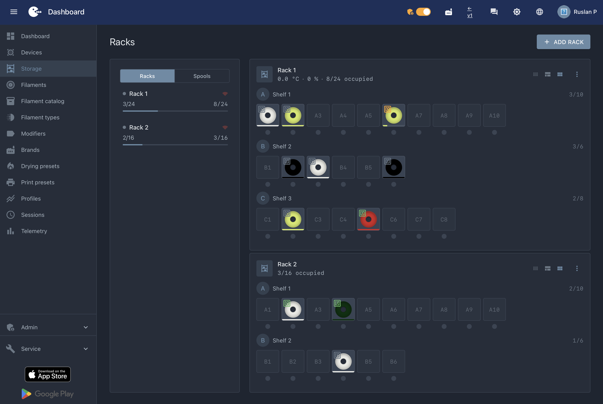
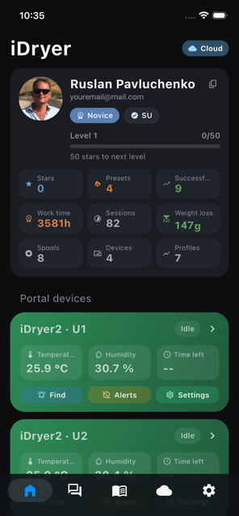
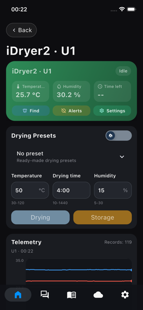

# iHeater Link

**Wi-Fi-модуль для iHeater. Принтер задаёт температуру камеры — камера греется сама.**

   

---

## Что это

Плата на ESP32, которая соединяет нагреватель [iHeater](https://github.com/pavluchenkor/iHeater) с принтером по Wi-Fi. Принтер сообщает, какая температура нужна в камере, iHeater Link передаёт это нагревателю.

Связь с нагревателем — один сигнальный провод. Wi-Fi и интеграции берёт на себя Link, нагрев и безопасность остаются за iHeater.

## Какую задачу решает

Активная камера нужна для ABS, PA, PC и других инженерных филаментов.

iHeater изначально делался под Klipper: там нагреватель подключается напрямую и живёт в конфигурации принтера. Но всё больше машин выходит с проприетарной прошивкой, куда не подключиться, — Bambu Lab, Creality, FlashForge и другие. Оставался выбор из плохого: взламывать прошивку, ставить альтернативную или обходиться без камеры.

iHeater Link этот выбор снимает. Он работает поверх того, что у принтера уже есть: Moonraker с готовым макросом у Klipper, MQTT у Bambu Lab. Прошивку принтера трогать не нужно, проводов к нему тянуть тоже.

Дальше всё происходит само: принтер сообщает, что печатает и чем, камера выходит на режим, по окончании печати отключается.

## Для кого

- У принтера нет активной термокамеры, а печатать ABS, PA или PC хочется.
- Нужен предсказуемый результат: без коробления, отрыва от стола и трещин между слоями.
- Нужны прочные детали, а не просто аккуратные: равномерная усадка и рабочая межслойная прочность.
- Печатаете партиями, где переделка стоит дороже нагревателя.

Принтеры с активной термокамерой стоят кратно дороже, хотя по механике часто отличаются от обычных только ею. iHeater с iHeater Link даёт ту же камеру, тот же сценарий работы и то же качество деталей — на принтере, который у вас уже стоит.

Готовые модули на рынке делятся на два лагеря. Недорогие собраны на универсальных термоконтроллерах, и вся электроника у них живёт внутри горячей камеры. Решения крупных производителей сделаны как следует, но и стоят соответственно. iHeater закрывает промежуток: инженерная камера без переплаты, с возможностью настроить прошивку под свои задачи.

## Почему плата снаружи

Камера в работе держит 60 °C и выше. ESP32 в такой среде перегревается, а при длительном нагреве рвётся Wi-Fi. Корпус принтера к тому же зачастую работает как экран.

Один сигнальный провод снимает этот вопрос: ESP32 ставится снаружи, внутри остаётся только iHeater, спроектированный для высокой температуры. Длина провода ограничена лишь разумной нагрузкой на линию — десятки сантиметров вопросов не вызывают.

## Как это выглядит

Три провода: питание, земля и сигнал.

| ESP | iHeater | Зачем |
|---|---|---|
| `5V` | `5V` | питание контроллера |
| `GND` | `GND` | общая земля |
| `GPIO3` | сигнальный вход | импульсная уставка |

> **Никогда не подключайте и не отключайте провода при поданном питании.**

Питание приходит на ESP по USB-C, а ESP питает iHeater по линии 5 В. Это самая простая схема. При необходимости iHeater можно запитать отдельно — Link от схемы питания не зависит.

## Портал и приложение

Устройство появляется в [portal.idryer.org](https://portal.idryer.org) и в мобильном приложении: показания, история, настройки.

Интеграции с принтером настраиваются здесь же — Bambu Lab, Moonraker и Home Assistant включаются в карточке устройства. Оттуда же нагрев можно включить или выключить вручную, когда автоматики недостаточно.

 

  

- [iDryer в App Store](https://apps.apple.com/app/idryer/id6760609044)
- [iDryer в Google Play](https://play.google.com/store/apps/details?id=org.idryer.mobile)

## Место в экосистеме

| Слой | Что делает | Репозиторий |
|---|---|---|
| Нагреватель | Нагрев камеры, вентилятор, безопасность | [iHeater](https://github.com/pavluchenkor/iHeater) |
| Прошивка нагревателя | Standalone-режим, импульсный протокол | [iHeater Standalone Firmware](https://github.com/pavluchenkor/iHeater-Standalone-Firmware) |
| Связь | Wi-Fi, портал, интеграции — **этот репозиторий** | iHeater-link |
| Протокол | Контракт MQTT и UART, общий для всех | [idryer-core](https://github.com/pavluchenkor/idryer-core) |
| Облако | Портал, приложение, интеграции | [portal.idryer.org](https://portal.idryer.org/) |

## Что понадобится (BOM)

| Компонент | Кол-во | Примечание | Где взять |
|---|---|---|---|
| Плата ESP32-C3 Super Mini | 1 | подойдёт любая ESP32-C3 или ESP32-S3 со свободным GPIO | [ссылка](https://es.aliexpress.com/w/wholesale-es32-c3-super-mini.html) |
| Контроллер iHeater | 1 | с прошивкой `iheater_revX_X_pulse` | [store.idryer.org](https://store.idryer.org/) |
| Провода | 3 | питание, земля, сигнал | — |
| Кабель USB Type-C | 1 | питание и первая прошивка, подойдёт любой | — |

Проверенные платы: ESP32-C3 Super Mini, ESP32-C3 DevKitM-1, Seeed XIAO ESP32-S3, Waveshare ESP32-S3-Zero.

## Сложность и стоимость

| | |
|---|---|
| Пайка | не требуется при использовании готовых проводов |
| 3D-печать | не требуется |
| Опасное напряжение | нет, на стороне Link только 5 В |
| Навыки | подключить три провода и залить прошивку через браузер |
| Время | около получаса |
| Стоимость платы | ~$1,5 |

## Быстрый старт

1. **Подключите три провода** к iHeater: `5V`, `GND`, `GPIO3` на сигнальный вход. Питание при этом должно быть отключено.
2. **Прошейте через браузер** на [install.idryer.org](https://install.idryer.org/).
3. **Подключите к Wi-Fi** и привяжите устройство на [portal.idryer.org](https://portal.idryer.org/).
4. **Включите интеграцию** с принтером: Moonraker, Bambu Lab или Home Assistant. Для Moonraker добавьте на принтер готовый макрос — без него уставка до Link не дойдёт.
5. **Запустите печать** с заданной температурой камеры — нагрев включится сам.

Подробная инструкция — в [документации](https://docs.idryer.org/projects/iheater/link/).

## Интеграции

| Принтер | Что нужно сделать на принтере | Как работает |
|---|---|---|
| **Bambu Lab** | ничего | Link подключается к принтеру по MQTT в локальной сети, видит активный филамент и начало печати, берёт температуру камеры из таблицы материалов |
| **Klipper** | один файл `virtual_chamber.cfg` с парой макросов, подключается из `printer.cfg` | макросы перехватывают стандартные `M141` и `M191`, Link читает уставку по сети |
| **Home Assistant** | ничего | уставка приходит из сценариев умного дома |

Для Klipper не нужен ни root-доступ, ни правка прошивки принтера — достаточно доступа к пользовательским макросам. Это и есть путь для закрытых принтеров на Klipper: Creality, FlashForge.

Слайсер дорабатывать не нужно: `M141` и `M191` — стандартные команды температуры камеры, он шлёт их сам. Требуется только одно — задать температуру камеры в профиле материала.

Пошаговая настройка — в [документации](https://docs.idryer.org/projects/iheater/link/).

## Статус

Рабочая прошивка. Все три интеграции в строю: Bambu Lab и Klipper проверены на железе, цепочка «принтер → уставка → нагрев» отработана от старта печати до выключения камеры. Home Assistant подключается из карточки устройства.

Развивается вместе с прошивкой iHeater и порталом.

## Платы и протокол

Прошивка собирается под любую ESP32 со свободным GPIO под сигнал, в крайнем случае с небольшими модификациями. Готовые среды сборки перечислены в `platformio.ini`.

Протокол общий для экосистемы и определён в `idryer-core` (`contracts/mqtt_contract.yaml`). Изменения вносятся там и генерацией расходятся по прошивкам и порталу. В этом репозитории протокол не правится.

## Лицензия

Код — [Apache License 2.0](LICENSE), [NOTICE](NOTICE).

Имя iDryer лицензией не покрывается — [TRADEMARKS.md](https://github.com/pavluchenkor/idryer-core/blob/main/TRADEMARKS.md).

Конструкция железа лицензируется отдельно.

## Помощь

- [Telegram](https://t.me/iDryer)
- [Discord](https://discord.gg/jGce5eeHHz)
- [Документация](https://docs.idryer.org/projects/iheater/link/)

Инструкции и разборы на канале: [YouTube](https://www.youtube.com/@iDryerProject) · [Rutube](https://rutube.ru/channel/34401569/)

## Участие

Собрали на другой плате, проверили интеграцию со своим принтером, нашли расхождение — заводите issue или присылайте pull request.

## Дальше

[Прошейте плату через браузер](https://install.idryer.org/).

