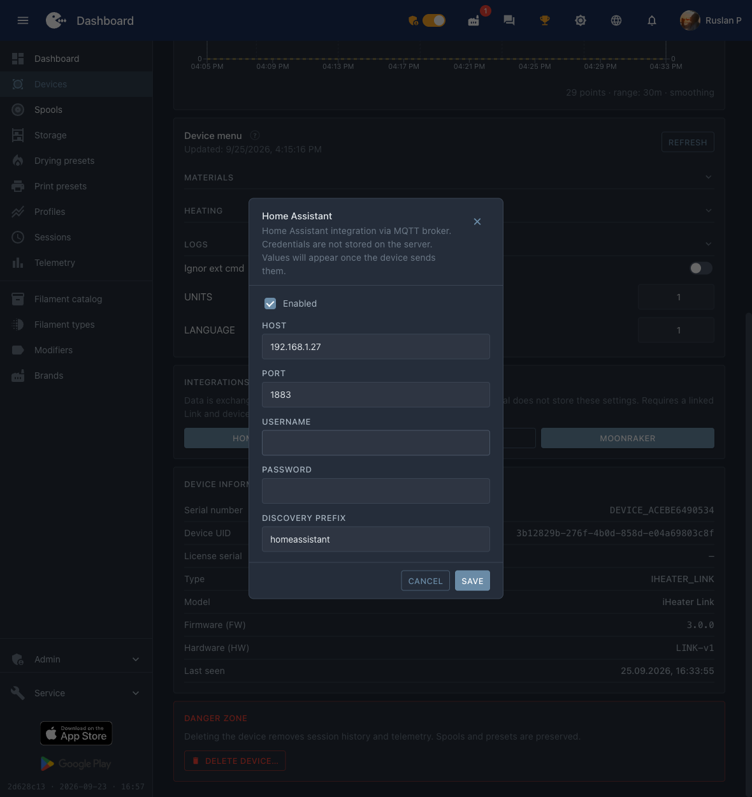

# Home Assistant

iHeater Link se do Home Assistant publikuje přes **MQTT Discovery**: HA sám vytvoří entity — teplotu, výkon ohřevu, pole pro spuštění a tlačítka. Portál k tomu není potřeba, vše jde přes váš MQTT broker.

Níže je zapnutí integrace, kontrola a hotové rozložení karty, aby zařízení vypadalo úhledně, a ne jako seznam entit.


*Teplota komory, výkon ohřevu a spuštění ohřevu v jednom bloku.*

!!! note
    Zařízení se **neobjeví** v `Settings → Devices & services → Discovered`: jde o MQTT Discovery, ne o UPnP/zeroconf. Integrace **MQTT** musí být v Home Assistant přidána předem.

## Co je potřeba

1. MQTT broker: doplněk **Mosquitto broker** v Home Assistant nebo libovolný broker ve vaší síti.
2. V Home Assistant je přidaná integrace **MQTT**, která ukazuje na tento broker.
3. iHeater Link je v síti a na portálu `Online`.

!!! info "iHeater Link je komunikační modul pro řadič iHeater; nahrajte do řadiče firmware [iheater_revX_X_pulse](https://github.com/pavluchenkor/iHeater-Standalone-Firmware/releases)."

## Krok 1. Zapnout integraci na zařízení

Otevřete zařízení na [portal.idryer.org](https://portal.idryer.org/) a najděte blok **Integrace** → **Home Assistant**.

| Pole | Co vyplnit |
|---|---|
| Host | adresa brokeru ve vaší síti, například `192.168.1.27` |
| Port | port brokeru, obvykle `1883` |
| Username / Password | přihlašovací údaje brokeru, pokud je vyžaduje |
| Discovery prefix | `homeassistant`, pokud jste jej v nastavení HA neměnili |
| Zapnuto | zaškrtnutí — jinak se zařízení k brokeru nepřipojí |

Nastavení jde přímo do zařízení po místní síti — portál je neukládá. Home Assistant se zapíná vlastním přepínačem a nepřekáží tiskovým integracím: Bambu Lab a Moonraker se volí zvlášť a současně funguje jedna z nich.


*Adresa brokeru, port a příznak „Zapnuto“ — vše, co zařízení potřebuje.*

## Krok 2. Najít zařízení v Home Assistant

V postranní nabídce dole klikněte na **Settings**.


Vyberte **Devices & services**.


Najděte kartu **MQTT**. Pod názvem je čítač připojených zařízení.


V sekci **Services** rozbalte uzel brokeru. Zařízení iDryer jsou vidět pod sériovými čísly ve tvaru `DEVICE_*`.


Otevřete zařízení: HA už ukazuje hodnoty a ovládací prvky.


## Krok 3. Sestavit kartu

HA si entity rozloží sám a vznikne dlouhý seznam. Hotové rozložení dá hodnoty nahoru a spuštění ohřevu do samostatného bloku.

1. `Settings` → `Dashboards` → **Add dashboard** → prázdný dashboard, otevřete jej.
2. Pravý horní roh → tužka (**Edit**) → nabídka „⋮“ → **Raw configuration editor**.
3. Vložte obsah níže a uložte.

Rozložení počítá s dashboardem typu `sections`.

```yaml
title: iDryer
views:
- title: Devices
  path: devices
  type: sections
  max_columns: 4
  sections:
  - type: grid
    background: true
    cards:
    - type: heading
      heading: iHeater Link
      heading_style: title
      icon: mdi:radiator
      badges:
      - type: entity
        entity: sensor.iheater_link_mode
        show_icon: false
        show_state: true
        color: primary
    - type: tile
      entity: sensor.iheater_link_temperature
      name: Temperature
      visibility:
      - condition: state
        entity: sensor.iheater_link_temperature
        state_not:
        - unknown
        - unavailable
    - type: tile
      entity: sensor.iheater_link_heater_power
      name: Heater power
    - type: heading
      heading: Heat
      heading_style: subtitle
    - type: tile
      entity: number.iheater_link_heat_temperature
      name: Temperature
      features:
      - type: numeric-input
        style: buttons
      features_position: bottom
    - type: tile
      entity: number.iheater_link_heat_duration
      name: Duration
      features:
      - type: numeric-input
        style: buttons
      features_position: bottom
    - type: tile
      entity: button.iheater_link_heat
      name: Start heating
      icon: mdi:play
      hide_state: true
      tap_action: &id001
        action: perform-action
        perform_action: button.press
        target:
          entity_id: button.iheater_link_heat
      icon_tap_action: *id001
    - type: tile
      entity: button.iheater_link_stop
      name: Stop
      icon: mdi:stop
      hide_state: true
      tap_action: &id002
        action: perform-action
        perform_action: button.press
        target:
          entity_id: button.iheater_link_stop
      icon_tap_action: *id002
```


*Totéž rozložení v editoru konfigurace dashboardu.*

Pořadí spuštění je stejné jako v aplikaci: nejprve se zadá teplota a délka, pak se stiskne **Spustit ohřev**. Tlačítko **Stop** ohřev vypne.

## Pokud se názvy entit neshodují

Rozložení počítá se standardními identifikátory ve tvaru `sensor.iheater_link_temperature`. Pokud karta ukazuje „Entity not found“, podívejte se na své: `Settings` → `Devices & services` → **MQTT** → vaše zařízení → seznam entit — a nahraďte prefix v rozložení svým.

## Co se děje pod kapotou

- Složení entit oznamuje zařízení samo — z popisu své karty: hodnoty, pole parametrů a tlačítka akcí. Co zařízení nemá, to se v Home Assistant neobjeví.
- Hodnoty se publikují do MQTT spolu s běžnou telemetrií; HA je dostává v reálném čase.
- Stisk tlačítka v HA přijde do zařízení jako stejná akce jako z portálu nebo aplikace — žádná zvláštní logika „pro Home Assistant“ ve firmwaru není.

## Diagnostika

| Příznak | Co zkontrolovat |
|---|---|
| Zařízení se v HA neobjevilo | Na portálu má integrace Home Assistant zaškrtnuté „Zapnuto“, adresa a port brokeru jsou správné. Zařízení musí být `Online`. |
| Objevilo se, ale hodnoty jsou `Unknown` | Počkejte na cyklus telemetrie. Pokud je prázdno i dál — broker neuchovává retained zprávy nebo se k němu zařízení nepřipojilo. |
| Není teplota komory | Snímač není připojený k řadiči iHeater: bez něj zařízení tuto veličinu nepublikuje. |
| Tlačítka nereagují | Zkontrolujte, že broker povoluje publikaci do témat `idryer/#` a že zařízení nemá v logu chyby autorizace. |
| Duchové entit s hodnotou `Unknown` | Zůstaly retained zprávy z předchozího firmwaru. Vyčistěte je: `mosquitto_pub -h <broker> -t 'homeassistant/<...>/config' -n -r`. |
| Spolu s Home Assistant zmizel Bambu nebo Moonraker | Home Assistant s tím nemá nic společného — zapíná se zvlášť. Zkontrolujte volbu tiskové integrace: funguje jedna z nich. |
