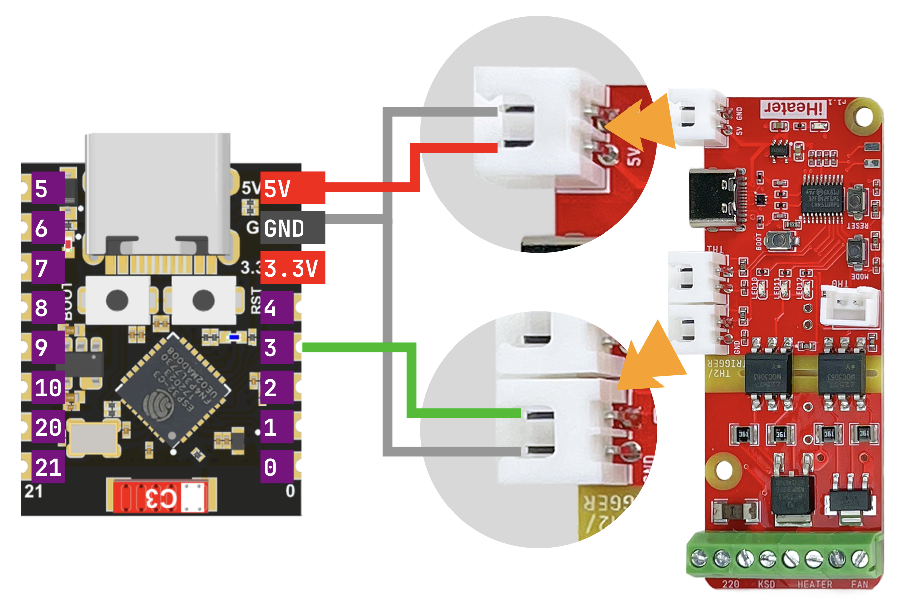
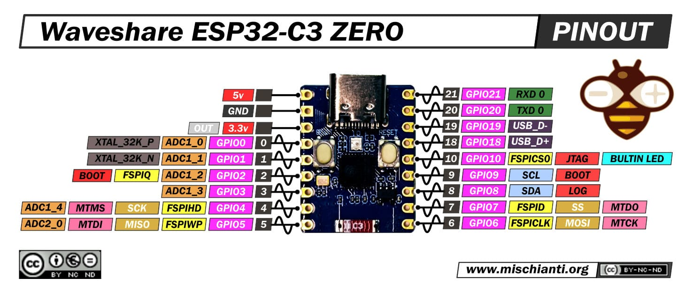

# iHeater Link — guía rápida

iHeater Link es un módulo de comunicación para el controlador **iHeater** con firmware [iheater_revХ_Х_pulse](https://github.com/pavluchenkor/iHeater-Standalone-Firmware/releases). Es una placa basada en ESP32-C3 / ESP32-S3 que:

- Se conecta a Wi-Fi y vincula iHeater con [portal.idryer.org](https://portal.idryer.org/).
- Recibe la temperatura objetivo de la cámara de la impresora a través de
  integraciones **Moonraker (Klipper)**, **Bambu Lab (LAN)** o
  **Home Assistant**.
- Convierte la temperatura objetivo en una señal de pulso y la envía al controlador iHeater en un GPIO.

El control de iHeater se realiza «por cable»: un pin de señal ESP → entrada de señal iHeater. Wi-Fi e integraciones son responsabilidad de Link, calefacción y seguridad son responsabilidad de iHeater.

La conexión de un solo cable no impone restricciones en la ubicación de Link. La placa ESP se puede sacar fuera de la cámara térmica. Esto elimina:

- sobrecalentamiento del chip y periféricos cuando la cámara funciona a 60+ °C;
- congelamiento térmico de la sección de radio e interrupciones de sesión Wi-Fi durante el calentamiento prolongado;
- degradación acelerada.

Dentro de la cámara solo permanece iHeater, diseñado para funcionar a altas temperaturas. La longitud del cable de señal a ESP está limitada solo por la carga razonable en la línea (decenas de centímetros sin restricciones).

## Placas compatibles

| Placa                        |       |
| ---------------------------- | ----- |
| ESP32-C3 Super Mini          | `✅`  |
| ESP32-C3 DevKitM-1           | `✅`  |
| Seeed XIAO ESP32-S3          | `✅`  |
| Waveshare ESP32-S3-Zero      | `✅`  |

Cualquier otra placa basada en ESP32-C3 o ESP32-S3 se puede utilizar si
hay un GPIO libre para la salida de señal. Consulte el diagrama de pines
del fabricante.

## Esquema de conexión

!!! warning "Nunca conecte ni desconecte cables mientras el dispositivo está alimentado."

La alimentación se suministra a ESP a través de USB-C. ESP a su vez alimenta el controlador iHeater por la línea de 5 V. Esta es la opción más simple. Si es necesario, la alimentación de iHeater se puede organizar de otra manera — la comunicación con Link no depende del esquema de alimentación.

Conexiones (para todas las placas compatibles):

| ESP        | iHeater          | Propósito             |
| ---------- | ---------------- | --------------------- |
| `5V`       | `5V`             | alimentación del controlador   |
| `GND`      | `GND`            | tierra común           |
| `GPIO3`    | entrada de señal  | setpoint de pulso   |

### Diagrama de pines

ESP32-C3 Super Mini:

Waveshare ESP32-S3-Zero:

## Flasheo mediante el instalador web

El instalador web se encuentra en [install.idryer.org](https://install.idryer.org/).

1. Conecte Link al puerto USB de su computadora.
2. Abra [install.idryer.org](https://install.idryer.org/) y seleccione el dispositivo **iHeater Link**.
3. Seleccione la variante de placa.
4. Haga clic en **Connect**, seleccione el puerto serie (generalmente `USB JTAG/serial`
   o `CH340`). Si el dispositivo no se detecta, mantenga presionado el botón `BOOT`
   en la placa y presione brevemente `RST`.
5. Haga clic en **Install**. El instalador escribirá el firmware.
6. Una vez completado el flasheo, se abrirá el asistente de configuración de Wi-Fi.

## Configuración de Wi-Fi

Después del flasheo, el asistente Improv se abre automáticamente en el puerto serial.

1. Ingrese el SSID y la contraseña de su red de 2,4 GHz.
2. Espere el estado **Connected**. El indicador de Link pasará a
   modo de «respiración» en azul.

Si el asistente no se abrió, desconecte el USB y vuelva a conectar mediante
**Connect** sin flashear de nuevo.

!!! note "ESP32 solo admite 2,4 GHz. Las redes de 5 GHz no funcionan."

## Vinculación al portal

1. En la página del instalador, haga clic en **Conectar y ejecutar Claim**.
2. Se enviará el comando `START_CLAIM` al dispositivo. Después de unos segundos
   aparecerá un PIN en la página. El PIN es válido durante aproximadamente 5 minutos.
3. Abra [portal.idryer.org](https://portal.idryer.org/) → **Agregar
   dispositivo** → ingrese el PIN.
4. Después de la vinculación exitosa, el dispositivo aparecerá en la lista en línea.

Si la respuesta fue `CLAIM_ALREADY:DEVICE_…` — el dispositivo ya está vinculado a esta u otra cuenta. En este caso, elimine el dispositivo en el portal y repita la vinculación.

## Conexión a iHeater

1. Apague la alimentación del controlador.
2. Conecte ESP a iHeater según el esquema anterior: `5V`, `GND`, `GPIO3` →
   entrada de señal iHeater.
3. Suministre alimentación al USB de ESP. El controlador se alimentará a través de la línea de 5 V.

Después de cargar, Link establecerá conexión con el portal, activará
la integración seleccionada y comenzará a transmitir la temperatura objetivo
de la cámara a iHeater.

## Qué debería obtener

- El LED 1 brilla constantemente, el LED 3 parpadea brevemente 1 vez por segundo, indicando conexión iHeater Link - iHeater.
- si se pierde la conexión, todos los LED parpadean a una frecuencia de 1 Hz.
- los otros errores están relacionados con iHeater Link y repiten la indicación del firmware independiente.

## Diagnóstico

En el menú del dispositivo hay un elemento **DIAGNOSTICS → DIAG LOG**. Cuando se habilita, se envía un informe detallado al puerto serial una vez por segundo: estado de Wi-Fi, MQTT, integración activa, objetivo actual, errores de conectores.

Para más detalles sobre diagnósticos, consulte la documentación de la biblioteca idryer-core, disponible en el repositorio del proyecto en GitHub.
