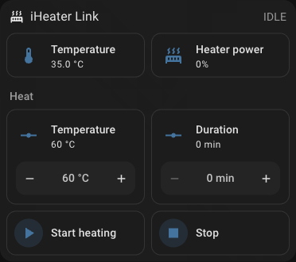
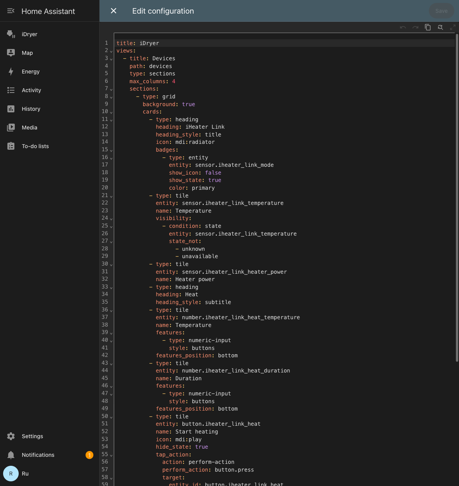

# Home Assistant

O iHeater Link se publica no Home Assistant via **MQTT Discovery**: o próprio HA cria as entidades — temperatura, potência de aquecimento, campos de início e botões. O portal não é necessário para isso, tudo passa pelo seu broker MQTT.

Abaixo: ativação da integração, verificação e um layout de cartão pronto, para que o aparelho fique organizado e não como uma lista de entidades.


*Temperatura da câmara, potência de aquecimento e início do aquecimento em um único bloco.*

!!! note
    O aparelho **não vai aparecer** em `Settings → Devices & services → Discovered`: isto é MQTT Discovery, não UPnP/zeroconf. A integração **MQTT** no Home Assistant deve estar adicionada com antecedência.

## O que é necessário

1. Um broker MQTT: o add-on **Mosquitto broker** no Home Assistant ou qualquer broker na sua rede.
2. A integração **MQTT** adicionada no Home Assistant, apontando para esse broker.
3. O iHeater Link na rede e `Online` no portal.

!!! info "iHeater Link — o módulo de comunicação do controlador iHeater; grave no controlador o firmware [iheater_revX_X_pulse](https://github.com/pavluchenkor/iHeater-Standalone-Firmware/releases)."

## Passo 1. Ativar a integração no aparelho

Abra o dispositivo em [portal.idryer.org](https://portal.idryer.org/) e encontre o bloco **Integrações** → **Home Assistant**.

| Campo | O que preencher |
|---|---|
| Host | o endereço do broker na sua rede, por exemplo `192.168.1.27` |
| Port | a porta do broker, normalmente `1883` |
| Username / Password | as credenciais do broker, se ele as exigir |
| Discovery prefix | `homeassistant`, se você não o alterou nas configurações do HA |
| Ativado | a caixa de seleção — sem ela o aparelho não se conecta ao broker |

As configurações vão direto para o aparelho pela rede local — o portal não as armazena. O Home Assistant é ligado pelo seu próprio interruptor e não interfere nas integrações de impressora: Bambu Lab e Moonraker são escolhidos separadamente, e apenas uma delas funciona por vez.


*O endereço do broker, a porta e a marca «Ativado» — tudo o que o aparelho precisa.*

## Passo 2. Encontrar o dispositivo no Home Assistant

No menu lateral, embaixo, clique em **Settings**.


Selecione **Devices & services**.


Encontre o cartão **MQTT**. Abaixo do nome há o contador de dispositivos conectados.


Na seção **Services** expanda o nó do broker. Os aparelhos iDryer aparecem sob números de série no formato `DEVICE_*`.


Abra o dispositivo: o HA já mostra as leituras e os controles.


## Passo 3. Montar o cartão

O HA distribui as entidades por conta própria, e o resultado é uma lista longa. O layout pronto coloca as leituras em cima e o início do aquecimento em um bloco separado.

1. `Settings` → `Dashboards` → **Add dashboard** → um painel vazio, abra-o.
2. Canto superior direito → o lápis (**Edit**) → o menu «⋮» → **Raw configuration editor**.
3. Cole o conteúdo abaixo e salve.

O layout é feito para um painel do tipo `sections`.

```yaml
title: iDryer
views:
- title: Devices
  path: devices
  type: sections
  max_columns: 4
  sections:
  - type: grid
    background: true
    cards:
    - type: heading
      heading: iHeater Link
      heading_style: title
      icon: mdi:radiator
      badges:
      - type: entity
        entity: sensor.iheater_link_mode
        show_icon: false
        show_state: true
        color: primary
    - type: tile
      entity: sensor.iheater_link_temperature
      name: Temperature
      visibility:
      - condition: state
        entity: sensor.iheater_link_temperature
        state_not:
        - unknown
        - unavailable
    - type: tile
      entity: sensor.iheater_link_heater_power
      name: Heater power
    - type: heading
      heading: Heat
      heading_style: subtitle
    - type: tile
      entity: number.iheater_link_heat_temperature
      name: Temperature
      features:
      - type: numeric-input
        style: buttons
      features_position: bottom
    - type: tile
      entity: number.iheater_link_heat_duration
      name: Duration
      features:
      - type: numeric-input
        style: buttons
      features_position: bottom
    - type: tile
      entity: button.iheater_link_heat
      name: Start heating
      icon: mdi:play
      hide_state: true
      tap_action: &id001
        action: perform-action
        perform_action: button.press
        target:
          entity_id: button.iheater_link_heat
      icon_tap_action: *id001
    - type: tile
      entity: button.iheater_link_stop
      name: Stop
      icon: mdi:stop
      hide_state: true
      tap_action: &id002
        action: perform-action
        perform_action: button.press
        target:
          entity_id: button.iheater_link_stop
      icon_tap_action: *id002
```


*O mesmo layout no editor de configuração do painel.*

A ordem de início é a mesma do aplicativo: primeiro se define a temperatura e a duração, depois se pressiona **Iniciar aquecimento**. O botão **Parar** desliga o aquecimento.

## Se os nomes das entidades não coincidirem

O layout é feito para os identificadores padrão do tipo `sensor.iheater_link_temperature`. Se o cartão mostrar «Entity not found», veja os seus: `Settings` → `Devices & services` → **MQTT** → o seu dispositivo → a lista de entidades, — e substitua o prefixo no layout pelo seu.

## O que acontece nos bastidores

- A composição das entidades é declarada pelo próprio aparelho — a partir da descrição do seu cartão: leituras, campos de parâmetros e botões de ações. O que o aparelho não tem não aparece no Home Assistant.
- Os valores são publicados no MQTT junto com a telemetria comum; o HA os recebe em tempo real.
- O toque em um botão no HA chega ao aparelho como a mesma ação vinda do portal ou do aplicativo — não há lógica separada «para o Home Assistant» no firmware.

## Diagnóstico

| Sintoma | O que verificar |
|---|---|
| O dispositivo não apareceu no HA | No portal, a integração Home Assistant está com a marca «Ativado», o endereço e a porta do broker estão corretos. O aparelho deve estar `Online`. |
| Apareceu, mas os valores estão `Unknown` | Aguarde um ciclo de telemetria. Se continuar vazio — o broker não guarda mensagens retained ou o aparelho não se conectou a ele. |
| Não há temperatura da câmara | O sensor não está conectado ao controlador iHeater: sem ele o aparelho não publica esse valor. |
| Os botões não funcionam | Verifique se o broker permite a publicação nos tópicos `idryer/#` e se não há erros de autorização no log do aparelho. |
| Entidades-fantasma com o valor `Unknown` | Restaram mensagens retained do firmware anterior. Limpe-as: `mosquitto_pub -h <broker> -t 'homeassistant/<...>/config' -n -r`. |
| Junto com o Home Assistant sumiu o Bambu ou o Moonraker | O Home Assistant não tem nada a ver com isso — ele é ligado separadamente. Verifique a escolha da integração de impressora: apenas uma delas funciona por vez. |
