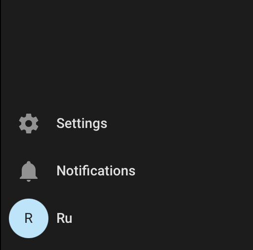
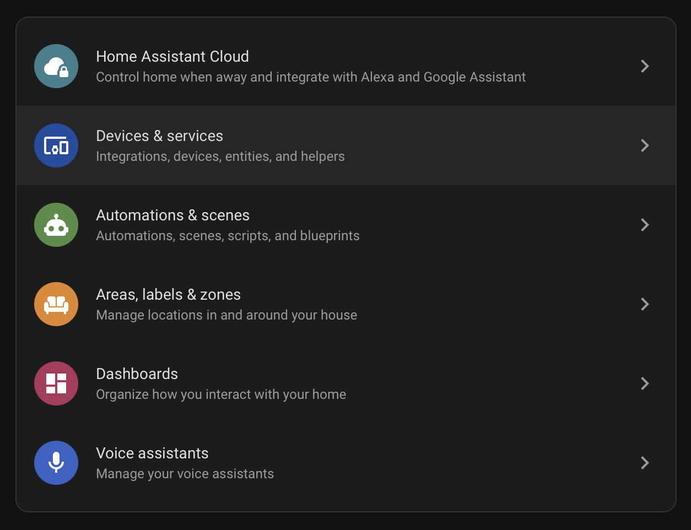
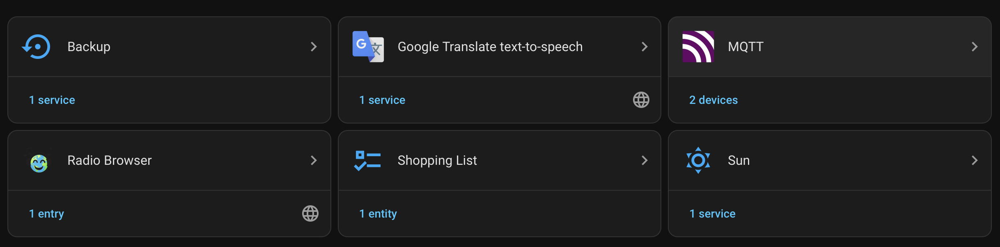
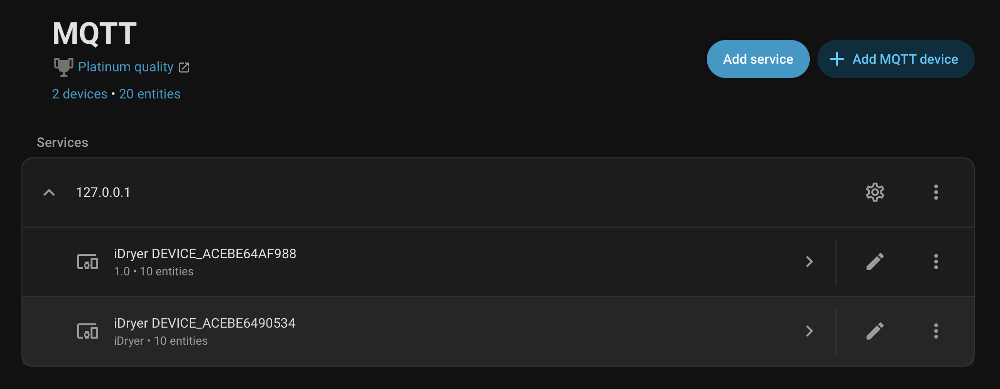
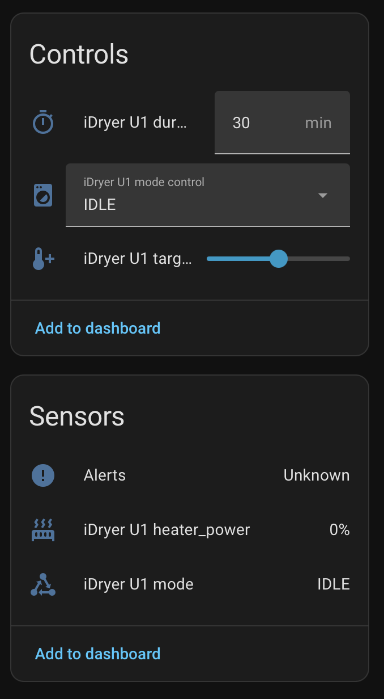

# Conectando iHeater Link ao Home Assistant

iHeater Link publica o dispositivo no Home Assistant por meio de MQTT Discovery: HA cria automaticamente um cartão com sensores reais e elementos de controle (temperatura alvo, duração, modo IDLE/DRYING/STORAGE).

!!! note
    O dispositivo **não aparecerá** em `Settings → Devices & services → Discovered`. iHeater Link usa MQTT Discovery, não UPnP/zeroconf. Home Assistant deve ter a integração **MQTT** **já adicionada**, apontando para seu broker.

## O que deve estar pronto

1. MQTT-broker (por exemplo, add-on Mosquitto) executando no HA ou acessível pela rede.
2. Em HA, a integração **MQTT** foi adicionada com o broker configurado.
3. iHeater Link recebeu o comando `link_integration {type:"ha"}` pelo portal e estabeleceu conexão com o mesmo broker.

## Passo 1. Abrir configurações

No menu lateral do Home Assistant, na parte inferior, clique em **Settings**.

## Passo 2. Ir para Devices & services

Na lista de seções de configurações, selecione **Devices & services**.

## Passo 3. Abrir integração MQTT

Na lista de integrações, encontre o cartão **MQTT**. Abaixo do nome — contador de dispositivos conectados.

## Passo 4. Encontrar dispositivo iDryer

Na página de integração, na seção **Services**, expanda o nó do broker (`127.0.0.1` ou endereço do seu broker). Sob ele estão listados os dispositivos iDryer com seus números de série no formato `DEVICE_*`.

Clique no dispositivo desejado.

## Passo 5. Controle e estado

Na página do dispositivo há dois blocos:

- **Controls** — elementos de controle:
  - `iDryer U1 duration` — duração em minutos
  - `iDryer U1 mode control` — modo (`IDLE` / `DRYING` / `STORAGE`)
  - `iDryer U1 target temp` — temperatura alvo (slider)
- **Sensors** — valores reais. A composição depende do tipo de dispositivo (`Config` define quais sensores são publicados):
  - iHeater Link: `heater_power`, `mode`, `alerts`
  - Storage Link: o mesmo mais `temperature`, `humidity`

Para iniciar o aquecimento:

1. Defina a temperatura alvo com o slider.
2. Defina a duração.
3. Selecione o modo `DRYING` ou `STORAGE` no seletor.

Para parar — mude o seletor para `IDLE`.

!!! note
    Os valores `target temp` e `duration` são primeiro salvos no dispositivo como "pendentes", o início real ocorre quando o modo é selecionado. Isso permite definir parâmetros em qualquer ordem e iniciar com uma única ação.

## O que acontece nos bastidores

- **Discovery** (criação de entidade na UI do HA com ícones corretos) — publicada automaticamente ao conectar ao broker do HA. A composição é determinada pelos sinalizadores `Config.hasXxx` — sensores ausentes não aparecem como fantasmas.
- **State** (valores atuais) — publicada em tópicos do HA a cada 5 segundos em paralelo com a publicação no portal.
- **Comandos** (`set_temp` / `set_duration` / `set_mode`) — vêm de HA → MQTT-broker → dispositivo → são montados em `Request` e passam pelo mesmo caminho que os comandos do portal. Sem branches específicas de HA no código do produto.

## Diagnóstico

| Sintoma | O que verificar |
|---------|-----------------|
| Dispositivo não aparece no HA | No dispositivo no portal — `Home Assistant → Habilitado: sim`. O campo `ha.state` em `integrations/status` deve ser `online`. |
| Discovery publicado, mas cartão vazio | Aguarde 5–10 segundos após a primeira conexão. Se os valores não aparecerem — verifique se o MQTT-broker não está perdendo mensagens retained. |
| Botões de controle não respondem | Verifique `command_topic` do Discovery — o tópico deve corresponder a `idryer/{serial}/U1/set_mode` etc. |
| Sensores fantasmas com valor Unknown | Discovery antigo retained de versão anterior do firmware. Após atualizar, aguarde o próximo ciclo de publicação de Discovery ou limpe retained: `mosquitto_pub -t 'homeassistant/.../config' -n -r`. |
