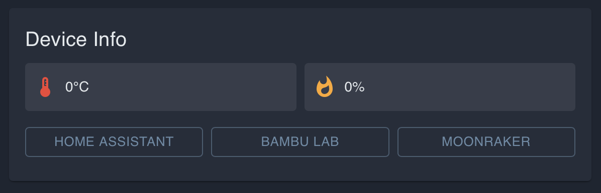
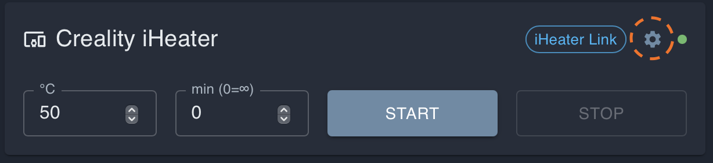
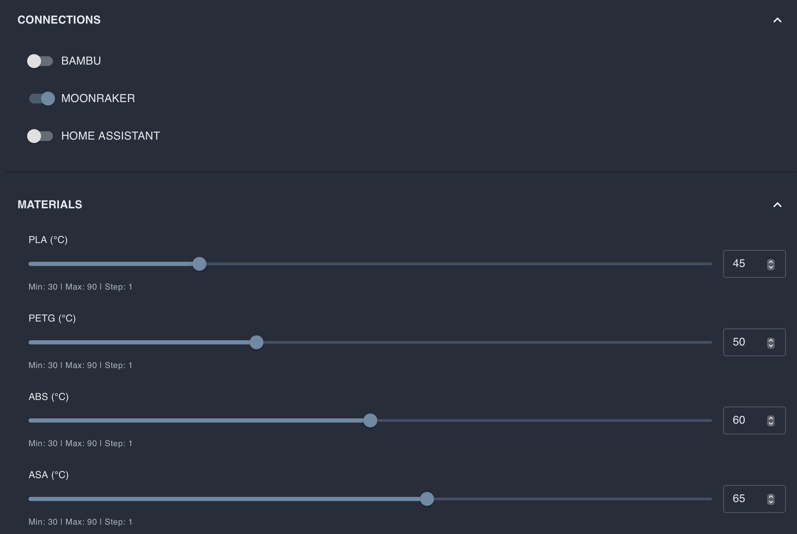
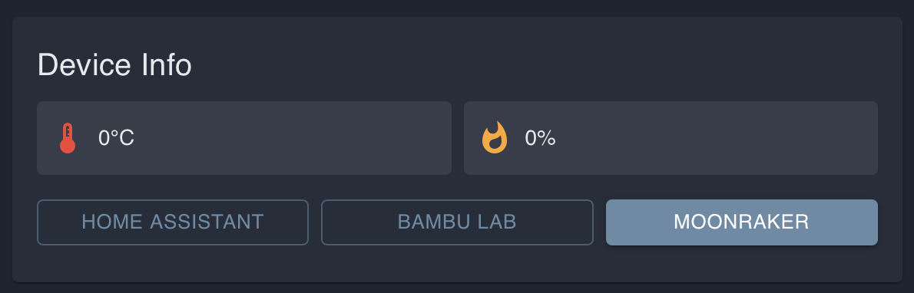
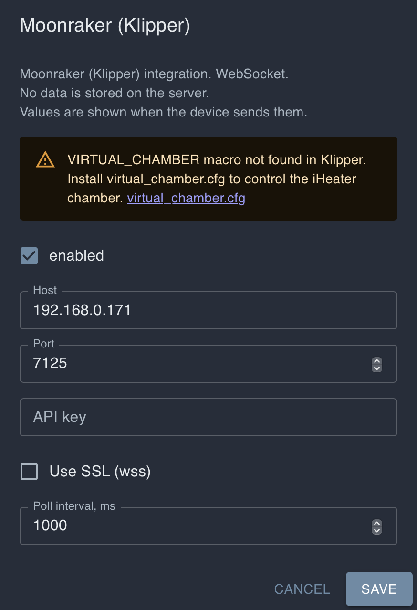

# Configuração do Klipper para iHeater Link

## Para que isso é necessário

Este recurso é destinado a impressoras baseadas em Klipper com sistemas fechados: Creality, Qidi, Flashforge e outros modelos modernos, onde o usuário não pode compilar e instalar o firmware iHeater para trabalhar diretamente com o Klipper.

Arquivos de configuração comuns do Klipper e macros G-code customizadas costumam estar disponíveis. Por isso, iHeater Link usa um caminho mais simples: ele se conecta à mesma rede Wi-Fi que a impressora, lê variáveis do macro Klipper customizado e transmite a temperatura alvo ao controlador iHeater.

No lado da impressora é necessário adicionar apenas alguns macros G-code. Eles aceitam comandos padrão de temperatura de câmara `M141` e `M191` e armazenam a temperatura alvo em `VIRTUAL_CHAMBER`.

Esquema final:

```text
Fatiador / G-code -> M141 S50 -> Klipper macro VIRTUAL_CHAMBER.target=50
                                      |
                                      v
Impressora na rede local <- Wi-Fi <- iHeater Link -> linha de sinal -> iHeater
```

O usuário não precisa obter acesso root ou interferir no firmware interno da impressora. Basta ter acesso aos macros Klipper customizados.

## O que você obterá

```text
M141 S50 -> target = 50 -> iHeater Link ativa o aquecimento
M141 S0  -> target = 0  -> iHeater Link desativa o aquecimento
```

Muitas impressoras modernas já possuem um sensor de temperatura dentro da câmara. Se esse sensor for fornecido pelo fabricante e visível na configuração do Klipper, pode ser usado para transmitir a temperatura real ao portal e ao iHeater Link. Se não houver sensor, iHeater Link ainda poderá controlar o aquecimento pela temperatura alvo.

## 1. Adicione o arquivo de macros

Crie um arquivo `virtual_chamber.cfg` na configuração do Klipper e inclua-o em `printer.cfg`:

```ini
[include virtual_chamber.cfg]
```

Conteúdo de `virtual_chamber.cfg`:

```ini
[gcode_macro VIRTUAL_CHAMBER]
variable_target: 0
variable_temperature: -1
variable_has_sensor: 0
gcode:

[gcode_macro M141]
gcode:
  {{ "" }}
  SET_GCODE_VARIABLE MACRO=VIRTUAL_CHAMBER VARIABLE=target VALUE={t}

[gcode_macro M191]
gcode:
  {{ "" }}
  SET_GCODE_VARIABLE MACRO=VIRTUAL_CHAMBER VARIABLE=target VALUE={t}

[gcode_macro CLEAR_VIRTUAL_CHAMBER]
gcode:
  SET_GCODE_VARIABLE MACRO=VIRTUAL_CHAMBER VARIABLE=target VALUE=0
  SET_GCODE_VARIABLE MACRO=VIRTUAL_CHAMBER VARIABLE=temperature VALUE=-1
  SET_GCODE_VARIABLE MACRO=VIRTUAL_CHAMBER VARIABLE=has_sensor VALUE=0
```

Após salvar, reinicie o Klipper ou execute `RESTART`.

## 2. Opcionalmente conecte o sensor de câmara

Abra a configuração da impressora e verifique se existe um objeto semelhante a um sensor de temperatura de câmara. Em diferentes fabricantes e compilações, pode ser nomeado de forma diferente, por exemplo:

```ini
[temperature_sensor chamber]
```

```ini
[temperature_sensor enclosure]
```

```ini
[temperature_sensor chamber_temp]
```

```ini
[heater_generic chamber]
```

Se esse objeto existir, você pode transmitir a temperatura real ao iHeater Link. Adicione o bloco abaixo em `virtual_chamber.cfg` e substitua `heater_generic chamber` pelo nome do objeto em sua configuração:

```ini
[delayed_gcode UPDATE_VIRTUAL_CHAMBER_TEMP]
initial_duration: 1.0
gcode:
  {{ "" }}
  SET_GCODE_VARIABLE MACRO=VIRTUAL_CHAMBER VARIABLE=temperature VALUE={t}
  SET_GCODE_VARIABLE MACRO=VIRTUAL_CHAMBER VARIABLE=has_sensor VALUE=1
  UPDATE_DELAYED_GCODE ID=UPDATE_VIRTUAL_CHAMBER_TEMP DURATION=2.0
```

Por exemplo, se seu sensor for descrito como `[temperature_sensor enclosure]`, a linha de leitura de temperatura deve fazer referência a `printer["temperature_sensor enclosure"].temperature`.

Se você não tiver um sensor ou não tiver certeza, pule esta etapa. O `target` transmitido pelos macros `M141` e `M191` é suficiente para controlar o aquecimento.

## 3. Ative a integração Klipper no iHeater Link

No portal, abra o dispositivo iHeater Link e clique em **MOONRAKER** no bloco **Device Info**. Na interface, este nome é usado para impressoras baseadas em Klipper.



Em seguida, clique no ícone de engrenagem na placa do dispositivo, abra as configurações de conexão e ative **MOONRAKER**.





Retorne às configurações **MOONRAKER**, especifique o endereço IP da impressora e salve as configurações.





Normalmente, os seguintes parâmetros são suficientes:

- Host: endereço IP da impressora na rede local;
- Port: `7125`;
- API key: deixe em branco se a impressora não exigir;
- Use SSL (wss): desativado para conexão local comum;
- Poll interval: `1000`.

Após salvar, iHeater Link começará a ler `VIRTUAL_CHAMBER.target` do Klipper e transmitir para o iHeater.

## 4. Controle manual do portal

Você pode ativar o aquecimento sem um fatiador: defina a temperatura da câmara na placa do dispositivo e pressione **START**. No campo de tempo, você pode especificar a duração do aquecimento em minutos. Se deixar o tempo como `0`, iHeater funcionará indefinidamente até você pressionar **STOP** ou enviar um comando de desligamento.


## 5. Verifique o funcionamento dos macros

No console do Klipper, execute:

```gcode
M141 S50
```

iHeater Link deve receber `target=50` e ativar o aquecimento do iHeater.

Em seguida, execute:

```gcode
M141 S0
```

Target se tornará `0` e iHeater Link desativará o aquecimento.

## 6. Configure o fatiador

O fatiador não precisa conhecer `VIRTUAL_CHAMBER`. Ele deve enviar comandos padrão de temperatura de câmara:

- `M141 S{T}` — definir temperatura de câmara sem esperar;
- `M191 S{T}` — definir temperatura de câmara com espera.

Os macros do Klipper interceptarão esses comandos e escreverão o valor em `VIRTUAL_CHAMBER.target`.

### OrcaSlicer / Bambu Studio

A temperatura da câmara é definida no perfil de filamento:

```text
Filament Settings -> Temperatures -> Chamber temperature
```

Por exemplo:

- ABS / ASA: `40-50 °C`;
- PLA: `0 °C`.

Verifique o início do G-code. Deve haver uma linha como:

```gcode
M141 S45
```

### PrusaSlicer / SuperSlicer

Se o perfil tiver um campo de temperatura de câmara, use-o. Se não houver, adicione o comando manualmente no Start G-code:

```gcode
M141 S45 ; chamber temperature for this filament
```

## 7. Sempre desative o aquecimento no final da impressão

Após a impressão, o target não é redefinido automaticamente. Adicione ao End G-code:

```gcode
CLEAR_VIRTUAL_CHAMBER
```

ou:

```gcode
M141 S0
```

Isso redefinirá `VIRTUAL_CHAMBER.target` para `0`, após o qual iHeater Link desativará o iHeater.
