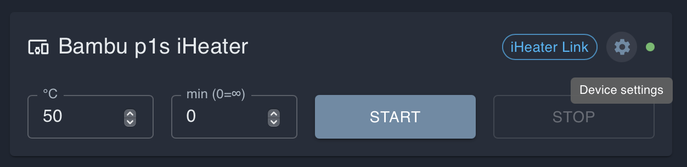
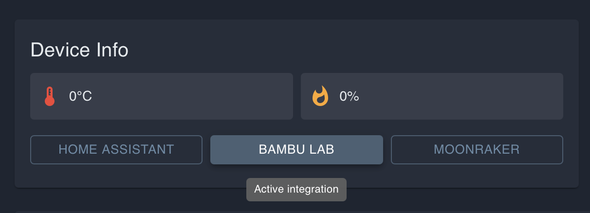
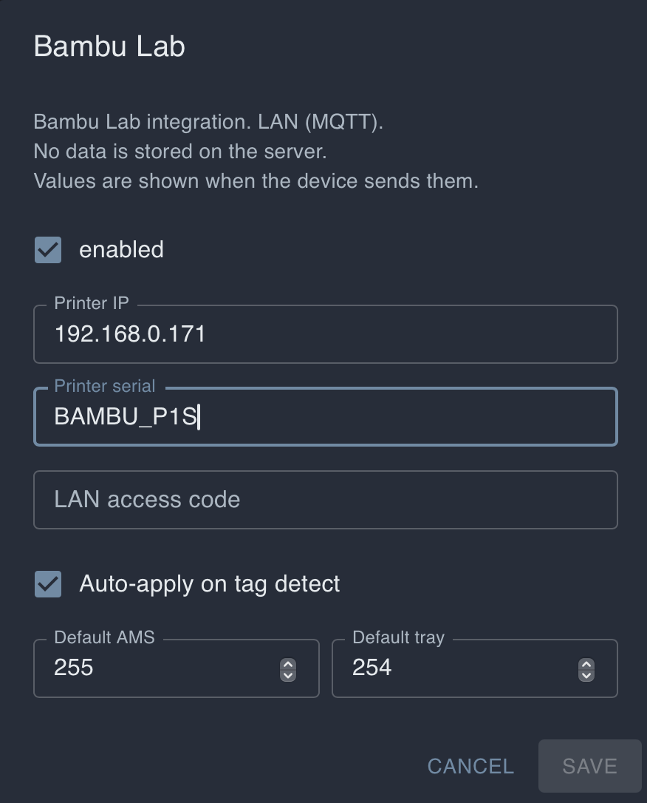

# 設定 Bambu Lab 整合 iHeater Link

## 為什麼需要這個

iHeater Link 可以在 Bambu Lab 印表機列印時自動管理 iHeater。與 Klipper 情況不同，無需向印表機添加巨集或修改 G-code。Link 通過區域網絡連接到印表機，並讀取列印狀態和活躍耗材。

在當前的 Bambu Lab 印表機上，無法可靠地使用腔室溫度傳輸作為 iHeater 控制命令。但是 Link 可以確定活躍托盤中當前安裝了哪種耗材，以及印表機是否開始準備列印或正在列印。根據耗材類型，固件從材料表中選擇所需的腔室溫度，並自動啟動 iHeater。

如果所需耗材類型不在固件材料列表中，請聯繫固件作者：該類型可以在後續版本中添加。

## 最終結果

```text
Bambu 開始準備或列印 -> Link 識別活躍耗材 -> 從材料表中選擇溫度 -> iHeater 啟動
```

列印結束或活躍場景不再需要加熱時，Link 會關閉 iHeater。

## 1. 打開設備設定

在入口網站上打開 iHeater Link 設備卡片，然後單擊齒輪圖示。



## 2. 啟用 Bambu 連接

在設備設定中打開 **CONNECTIONS** 區塊並啟用 **BAMBU**。如果不使用，其他連接可以保持禁用。


## 3. 在設備頁面選擇 Bambu Lab

返回設備頁面，在 **Device Info** 區塊中單擊 **BAMBU LAB**。按鈕將變為活躍。



## 4. 輸入連接參數

在 **Bambu Lab** 設定中啟用整合並填入連接參數。



通常需要以下欄位：

- Printer IP：印表機在區域網絡中的 IP 位址；
- Printer serial：印表機序列號；
- LAN access code：LAN 模式存取代碼；
- Auto-apply on tag detect：如果 Link 應根據識別的耗材自動應用溫度，請啟用；
- Default AMS 和 Default tray：如果不需要強制選擇特定 AMS 或托盤，可以保留預設值。

印表機和 iHeater Link 必須位於同一區域網絡中。LAN access code 和序列號可從 Bambu Lab 印表機設定中獲取。

## 5. 配置材料溫度

在設備設定中打開 **MATERIALS** 區塊。可以為每種耗材類型設定自己的腔室溫度。


固件已包含廣泛的耗材類型。當印表機開始準備列印或開始列印時，Link 將檢查活躍托盤，確定耗材類型，並從此表中獲取溫度。例如，PLA 可以設定低溫或禁用加熱，ABS 和 ASA 設定更高溫度。

如果在表中找不到活躍耗材，或為其設定了不適合的溫度，請在 **MATERIALS** 中編輯值並保存設定。

## 6. 驗證操作

在 Bambu Lab 上開始列印已在 **MATERIALS** 中設定溫度的耗材。當印表機進入準備或列印狀態時，iHeater Link 應自動為活躍耗材應用溫度並啟用 iHeater。

如果加熱未啟動，請檢查：

- 設備設定中是否啟用了 **BAMBU** 連接；
- 是否在 **Device Info** 區塊中選擇了 **BAMBU LAB**；
- IP、序列號和 LAN access code 是否正確輸入；
- 印表機是否可以識別活躍托盤和耗材類型；
- **MATERIALS** 中是否為此耗材類型設定了溫度。
